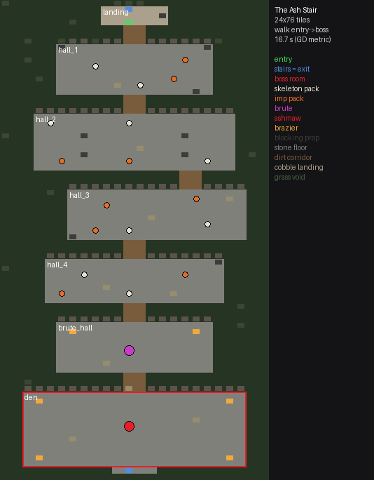

# RPG content, week 1: monsters, quests, the Ash Stair

Data for the week-1 slice, behind one small API (`RPGContent`). There is no state or DOM here. Core (GD) owns the game loop, the Store, rendering and combat. This file is meant to be read cold by the Skills & Quests dev and the Dungeon & Bosses dev.

**Scope (week 1)**
- **Ships:** Q1 *A Blade of Your Own* (UAT gate 2), Q2 *The Goblin Field*, the six monsters, and the Ash Stair dungeon with Ashmaw.
- **Stub:** Q3 *Beneath the Ash Stair* has `ship:'stub'`. Its targets are real, but `offerable()` skips it. This week players reach the dungeon through Q2's follow-up rumour line, which points at the Ash Stair gate and shows `Loot.preview('ashmaw')`, including Wyrmfang.
- **Cut to week 2:** Ground Slam, the Q3 build-out and the boss shield phase. The sim uses only Cleave, Sigil Bolt and the dodge.

## Files and load order

| file | what |
|---|---|
| `js/rpg/content/content-core.js` | namespace, `NPCS`, `ZONES`, `TOWN_POINTS`, `FIELD_SPAWNS`, `advance()`, `tracker()`, `trackerCount()`, `quest()`, `monster()` |
| `js/rpg/content/monsters.js` | `MONSTERS` (GD's shape + `def` + `atk`), `COMBAT_RULES`, `MIN_WINDUP_MS`, `MIN_BOSS_WINDUP_MS`, `REST_MS`, `TELEGRAPH` |
| `js/rpg/content/quest-data.js` | `QUESTS`, `QUEST_IDS`, `WEEK1_QUESTS`, `giverMarker()`, `offerable()` |
| `js/rpg/content/dungeon.js` | `Dungeon` / `DUNGEONS.ash_stair`: grid, legend, props, spawns, entry, exits, rooms, helpers |
| `js/rpg/content/index.js` | Node entry (`require` returns `RPGContent`) |
| `dev/content/combat-model.js` | GD's combat formula + the approved changes (mob hit roll, regen, XP rate) as code + a seeded fight simulator |
| `dev/content/loadouts.js` | gear loadouts built from real RPGItems Normal items (`ItemGen.stats`, summed like `Equipment.getStats`) |
| `dev/content/balance-sim.js` | mob danger table, balance table, dungeon clear estimate, XP and levels (`node dev/content/balance-sim.js`) |
| `dev/content/quest-times.js` | per-quest time estimate (`node dev/content/quest-times.js`) |
| `dev/content/dungeon-preview.py` | `docs/rpg-dungeon-ash-stair.png` (schematic); `--art [out]` renders with sheet art outside the repo |
| `dev/content/snapshot-sheets.js` | refreshes `dev/content/sheet-keys.json` (town, phaseb and rpg32 icon keys + sha256) |
| `dev/content/run-tests.js` | `npm run test:content` |

Browser order, after the RPGItems scripts:

```html
<script src="js/rpg/content/content-core.js"></script>
<script src="js/rpg/content/monsters.js"></script>
<script src="js/rpg/content/quest-data.js"></script>
<script src="js/rpg/content/dungeon.js"></script>
```

## API (`window.RPGContent`)

| member | returns |
|---|---|
| `MONSTERS[id]`, `MONSTER_IDS`, `monster(id)` | monster records (below) |
| `COMBAT_RULES` | the approved rule constants the data is tuned against: `{xpPerDamage:1, hpXpPerDamage:0.33, regenHpPerS:2, regenDelayMs:4000, mobHit:{base, perPoint, min, max}}` (informational; core owns combat) |
| `QUESTS`, `QUEST_IDS`, `WEEK1_QUESTS`, `quest(id)` | quest records |
| `advance(progress, ev)` | `{progress, advanced, stepDone, questDone}`. Pure. `progress = {questId, step, n}`, `ev = {type, target, count?}` |
| `tracker(progress)` | tracker line. `{n}`/`{count}` are filled in; text without `{n}` is shown verbatim (Q1 step 0 is exactly `Mine Rustbound ore`) |
| `trackerCount(progress)` | `{n, count}` for an optional "1/2" badge |
| `giverMarker(npcId, log)` | `'!'` (offerable), `'?'` (hand-in ready) or `''`. `log = {done:{questId:true}, active: progress \| null}` |
| `offerable(npcId, log, {stubs})` | first quest this NPC can offer now (stubs only with `{stubs:true}`) |
| `NPCS[id]` | `{id, name, key, shop?, bank?, idle:[lines]}`. Ids: `questgiver` (Warden Ilse), `smith` (Smith Oren), `banker`, `shopkeep` |
| `ZONES[id]` | `{id, name, map, kind:'map'\|'area', rect?, anchor?, to?}`: `town`, `goblin_field`, `ash_stair_gate`, `ash_stair`, `ash_stair_brute`, `ash_stair_boss` |
| `TOWN_POINTS[key]` | `{x, y}` in GD's D1 town grid, for arrows and estimates (NPCs, furnace, anvil, range, nodes, field, gate) |
| `FIELD_SPAWNS` | goblin-field packs in town coordinates (GD's three D1 spawns + one suggested goblin pack) |
| `Dungeon` | see "The Ash Stair" |

## Monsters

GD's shape, plus `def` (needed by GD's player hit formula), `atk` (**required**: core reads `mob.atk` for the mirrored mob hit chance) and a few optional fields:

```
{ id, name, hp, def, atk, speed (tiles/s), aggro (tiles), leash (tiles), xp, pack:[min,max],
  attacks:[{ kind:'melee'|'ranged'|'charge'|'slam', dmg, range (tiles), windupMs, cooldownMs,
             telegraph:'line'|'ring' (charge/slam), radius? (slam), minRange?, projectile?, name? }],
  zone, sprite, elite?, boss?, enrage? }
```

- **Windups:** every `windupMs` is at least 400, and every boss attack is at least 600 (tested).
- **Telegraphs:** `charge` draws with `telegraphLine` (length = `range`); `slam` draws with `telegraph` (ring radius = `radius`).
- **Cooldowns:** `cooldownMs` is per attack and counts from the hit. The sim also rests a mob `REST_MS` (500 ms) between any two attacks. Mobs try attacks in listed order and use the first one that is ready, so specials come first.
- **`atk`:** integer, on every monster (tested). Mob hit chance = `clamp(0.75 + 0.015*(atk − player Defence − gear.def), 0.40, 0.97)`, rolled for every attack that is not dodged. A dodge (roll or side-step) cancels the hit outright; armour still reduces a landed hit.
- **`xp`:** equals `1 × hp`, which is the style-stat XP a full kill pays under the per-damage rule (plus `0.33 × hp` to Hitpoints). It is for display only; GD pays XP per damage.
- **`minRange`** (goblin rock): only thrown while another mob holds melee.
- **Imps** are ranged only and should kite: hold 4-5 tiles and hop back when the player closes in.
- **`enrage`** (Ashmaw): attack cooldowns ×0.75 below 30% HP. It is optional, and is not the cut shield phase.
- **Sprites:** `mob_rat_*` and `mob_goblin_*` exist in `assets/rpg/mobs_sheet.json`. `mob_skeleton`, `mob_imp`, `mob_brute` and `mob_ashmaw` still need drawing.
- **Names** match the `RPGItems.Loot.MONSTERS` display names (tested).

## Quests

```
quest { id, order, title, giver, requires, ship:'week1'|'stub', summary,
        dialogue:{ offer:{lines, actions:[{id:'accept',label:'Accept'},{id:'decline',label:'Not now'}]},
                   progress:{lines}, complete:{lines, actions:[{id:'claim',label:'Claim reward'}]}, rumour? },
        onAccept:{ items:[{base, qty}] }, steps:[step], rewards:{ xp:{skill:n}, gold, items:[{base, qty}] }, next }
step  { text, arrowTo: npcId | nodeKey | zone | propKey, done:{ type, target, count } }
```

| `done.type` | `target` is | core sends the event when |
|---|---|---|
| `talk` | NPC id | the player opens that NPC's dialogue (the final step pays the reward) |
| `gather` | **item id** (e.g. `rustbound_ore`) | each successful gather swing (`Crafting.gather` ok) |
| `craft` | **recipe id** (e.g. `smelt_rustbound`) | each `Crafting.make` ok. Send it for burnt food too (Q2 counts attempts) |
| `equip` | item base id | `Equipment.equip` ok for that base |
| `kill` | monster id | a monster dies to the player |
| `enter` | zone id | the player steps into the zone rect / map |

**Flow (matches GD's Friday build)**
1. The questgiver shows `!` (`giverMarker`).
2. The offer dialogue ends in **Accept**. On Accept, core grants `onAccept.items` (`Inventory.grant({src:'quest', ref:questId, items})`) and the tracker shows `steps[0]` at once.
3. Each bus event goes through `advance()`.
4. At the last step (`talk` to the giver) the marker turns `?`. Talking pays `rewards`: gold via `Inventory.grant({src:'quest', ref, gold, items})`, which is ledger-tagged `quest`, and XP through core's stats.
5. Then `next` becomes offerable.

**Arrows**
- `arrowTo` names an NPC id, a zone id or a sheet key. Node keys are written without the `_full`/`_empty` suffix (e.g. `node_ore_rustbound`, the town sheet's `node_ore_rustbound_full`); point at the nearest non-empty node.
- `TOWN_POINTS` has a fallback coordinate for each.

### Q1 A Blade of Your Own (gate 2)
- **Offer (Warden Ilse):** "Empty hands on the Ash Stair road? That won't do. / Mine two lumps of Rustbound ore from the east rocks. / Smelt them at the furnace, then hammer a sword on the anvil. / Take this pick and hammer. Come back armed." [Accept] [Not now]
- **On accept:** Rustbound Pickaxe + Smithing Hammer.
- **Steps:**
  1. **Mine Rustbound ore** → `node_ore_rustbound` (gather `rustbound_ore` ×2)
  2. Smelt Rustbound bars at the furnace → `prop_furnace_0` (craft `smelt_rustbound` ×2)
  3. Smith a Rustbound Sword at the anvil → `prop_anvil_0` (craft `smith_rustbound_sword` ×1; **Smithing 1**, which is why the sword recipe level dropped from 2 to 1)
  4. Wield your Rustbound Sword (bag) → `questgiver` (equip `rustbound_sword`)
  5. Report to Warden Ilse (talk)
- **Rewards:** 25 gold (quest), 3 Hearth Bread, Mining +40 XP, Smithing +60 XP.
- **Estimate:** about 1.0 min at the speeds below, or about 2.6 min with ×2.5 new-player slack. Well under 10 min.

### Q2 The Goblin Field
- **Offer:** "Goblins dug in past the south pond. Rats run with them. / Fight hungry and you fight badly. Catch two fish and cook them. / Then thin the goblins. Four will do. Roll away from big swings." [Accept]
- **On accept:** Fishing Rod.
- **Steps:**
  1. Catch fish at the pond (n/2) → `node_fish_0`
  2. Cook fish at the range (n/2, attempts count) → `prop_range_0`
  3. Head to the Goblin Field → zone `goblin_field`
  4. Defeat goblins (n/4) → `goblin_field`
  5. Report to Warden Ilse
- **Rewards:** 60 gold, Rustbound Shield, 2 Traveller's Stew, Fishing +40, Cooking +40.
- **Follow-up rumour** (`dialogue.rumour`, shown after hand-in and as the giver's idle line afterwards):
  - "Miners swear a beast called Ashmaw nests under the Ash Stair. / They say it guards Wyrmfang, a blade cut from a wyrm's tooth. / The stair is at the end of the south path. Go geared."
  - `showDrops:'ashmaw'` tells GD to render `Loot.preview('ashmaw')` under the lines. `arrowTo:'ash_stair_gate'`.
- Q2 puts the player on the near-town packs (about 7-10 kills including rats), so first-Rare pity starts counting there. Pity counts every kill: the ramp starts at kill 10 and a Rare is guaranteed by kill 40. With the slower XP rate the player now grinds the field to Attack 5 / Defence 5 for Cinderiron (about 47-64 goblins), so the first Rare lands on the goblin field before the dungeon (tested).
- **Estimate:** about 1.8 min (×2.5 = 4.5 min). The fights are with the sword only, at about 28% HP per goblin pack (rolling telegraphs; 34% if the player never dodges). Regen (2 HP/s after 4 s) refills between packs.
- **Q1 + Q2 combined:** 2.8 min, or 7.1 min with ×2.5 slack (under 10, tested).

### Q3 Beneath the Ash Stair (stub, week 2)
- Steps: enter `ash_stair` → kill `ashmaw` → talk.
- Reward: 150 gold and 3 Traveller's Stew.
- Hidden unless `offerable(..., {stubs:true})`.

### Adding a quest (Skills & Quests dev)
1. Append to `QUESTS` with a unique `id`, `requires` and `next`.
2. Keep each line at 64 characters or less and each screen at 4 lines or less. Keep step text at 48 characters or less.
3. Use only real ids: NPC, recipe (`RPGItems.Modules.crafting.RECIPES`), item (`ItemsDb.hasBase`), node (`crafting.NODES`), monster or zone.
4. Run `npm run test:content`. It checks every target, every arrow, every item icon and banned names.

## The Ash Stair (dungeon)



- **Size and layout:** 24 × 76 tiles on GD's 32 × 18 art-px grid. Rooms stack vertically because N/S steps are cheap (18 px).
  - landing
  - halls 1-4 (pack rooms)
  - brute hall
  - the den (boss room, 20 × 12)
- **Legend:** same characters and edge rules as GD's town `world.js` (`baseKey` / `edgeKeys` are copied verbatim, including the variant hash):

  | char | tiles | edges | walk |
  |---|---|---|---|
  | `.` | `tile_grass_0-3` (phaseb) | n/a | **blocked** (void) |
  | `s` | `tile_stone_0/1` (phaseb) | `edge_grass_stone_*` | yes |
  | `d` | `tile_dirt_0-2` (phaseb) | `edge_grass_dirt_*` | yes |
  | `c` | `tile_cobble_0-2` (town) | `edge_grass_cobble_*` | yes |

  Note that in the town, GD's `d` means `tile_town_path`. Here `d` means phaseb dirt; use `Dungeon.legend` or `keyGrid()` rather than the town table.
- **Props:** `{key, x, y, block, frames?, tile?, decor?, role?}`.
  - Placement follows GD's `place()`: `tile:true` for `prop_wall_low_*`, otherwise foot-centred.
  - Braziers have 3 frames.
  - `role:'exit_town'` is the stair on the landing; `'exit_town_after_boss'` is the stair in the den; `'boss_gate'` is the arch.
  - Low walls and dead trees in the void are generated deterministically (`decor:true`).
- **Spawns:** `{monsterId, x, y, room}`. One entry is one pack, sized by `MONSTERS[id].pack`. There are 18 trash packs (skeleton/imp, about 45 mobs), 1 brute and 1 Ashmaw.
- **Entry and exits:**
  - `entry` is (11,3).
  - `exits[0]` is the landing stair at (11,1), leading to town (12,26).
  - `exits[1]` is the den stair at (11,74), leading to town and unlocked by `ashmaw`.
  - `townGate` / zone `ash_stair_gate` is the end of the south path in GD's town (12,27).
- **`bossRoom`:** `{x:2, y:62, w:20, h:12}`, which is zone `ash_stair_boss`. The brute hall is zone `ash_stair_brute`.
- **Helpers:**
  - `keyGrid()` returns `[[{base, edges}]]`, ready to draw.
  - `walkable(x,y)` blocks void and blocking props.
  - `keysUsed()` lists every sheet key the dungeon uses.
  - `bfs(from)` runs Dijkstra with GD's A* step costs: E/W 1, N/S 18/32, diagonal hypot, no corner cutting.
  - `walkSeconds(a,b)` converts that path to seconds at 80 px/s.
- **Walk time:** entry → Ashmaw without fighting is **16.7 s**, well under 60 s.
- **Editing the layout (Dungeon & Bosses dev):**
  1. Change `ROWS`, `ROOMS`, `PROPS` and `SPAWNS`.
  2. Run `npm run test:content`. It checks keys against the sheets, BFS entry → boss → every exit, walkable spawns, the room count and the walk time.
  3. Run `python3 dev/content/dungeon-preview.py` to refresh the PNG.
  4. `--art` renders the real sheet art to `/workspace/rpg-content-preview/ash_stair_art.png`. Do not commit that render: it is a scene composite.

## Balance

### Formula (implemented in `dev/content/combat-model.js`)

GD's core is unchanged; rows marked **approved** are the four approved changes this data is tuned for.

| item | rule |
|---|---|
| swing | 0.6 s at base weapon speed, ÷ (1 + attackSpeed%/100); a tap lands after a 0.12 s windup |
| player hit | `clamp(0.75 + 0.015*(Attack + gear.aim − target.def), 0.40, 0.97)` |
| damage | `max = 2 + floor(Strength/4) + gear.power`, uniform integer `ceil(max/2)..max` |
| **mob hit (approved)** | `clamp(0.75 + 0.015*(mob.atk − Defence level − gear.def), 0.40, 0.97)`, rolled for every mob attack (melee, ranged, slam, charge). A dodge cancels the hit outright (no roll); armour still reduces a landed hit |
| taken | `mob.dmg * 50 / (50 + armour)` on a landed hit |
| player HP | `40 + 6*(Hitpoints − 10)` (+ gear maxHp) |
| **regen (approved)** | 2 HP/s once 4 s have passed without taking damage. It also ticks mid-fight (e.g. a boss fight where every hit is dodged) |
| skills (week 1) | Cleave 1.3× in a 120° arc, 6 s cooldown; Sigil Bolt 1.2×, range 6, 4 s cooldown; Dodge: 0.35 s invulnerable, 2 s cooldown. **Ground Slam cut** |
| **combat XP (approved)** | 1 per damage to the style stat behind the hit + 0.33 per damage to Hitpoints (was 4 and 1.33) |
| **Ashmaw anchor (approved)** | ~90 s time-to-kill in Cinderiron for a typical week-1 player (Verdite comes out ~60 s) |
| XP curve | `floor(Σ_{l<L} floor(l + 300·2^(l/7)) / 4)`; Attack 40 = 37,224 |

### Assumptions the formula does not pin down (all flagged ASSUMED in code)
- **gear.def:** RPGItems gear has no `def` stat today, so `gear.def = 0` everywhere; gear protects through `armour`. The sim reads `gear.def` if items ever add it.
- **Armour:** `armour` = summed gear armour.
- **Crit:** ×1.5. Normal gear has 0 crit.
- **Skills:**
  - Skills replace a swing and use the same swing time.
  - Cleave hits up to 3 of a clumped pack.
  - Bolt is single-target and is used on a lone target when it would not overkill.
  - Cleave fires whenever it is ready and two or more mobs are up, or on an elite or boss.
- **Engagement:** pack members engage together, staggered by about 0.25 s (worst case: no pulling apart).
- **"Never dodges":** never rolls and never sidesteps.
- **"Dodging":**
  - rolls every slam and charge
  - rolls half the plain hits, but only when no telegraph is winding up
  - walks out of telegraphs of 0.8 s or longer 70% of the time when the roll is on cooldown (this costs a swing)
  - sidesteps half the projectiles
  - each roll costs 0.35 s of attack time
- **Food:** eaten only mid-fight, one per 0.6 s, below 35% HP. The table's death columns use a bag of 6 Traveller's Stew (12 HP each); a dungeon run carries a bag of 10 and counts what is eaten.
- **Between packs (dungeon run):** the run is sequential (HP, regen timer and food bag carry over). Regen ticks during the overhead (approach, loot, recover); the player then waits on regen to 70% HP before trash and to full before the brute and Ashmaw.
- **Levels per gear tier** (unchanged):

  | loadout | A/S/D | Hitpoints |
  |---|---|---|
  | starter (sword only) | 1 | 10 |
  | rustbound (full set) | 3 | 10 |
  | cinderiron | 8 | 12 |
  | verdite | 15 | 16 |
  | tidesteel | 25 | 25 |
  | sunforged | 35 | 35 |

  Under the new XP rate these are consistent with the XP table below: the Rustbound player is A1→7 / D1→5 while grinding the field; a typical (Attack-led) Cinderiron player enters the Ash Stair at A7/S5/D5 and reaches about A16/S11/D11 by Ashmaw, so A8/S8/D8 is a mid-clear figure. Sensitivity: Ashmaw in Cinderiron takes about 98 s at entry levels (A7/S5/D5/H12) and about 80 s at boss-time levels (A16/S11/D11/H16).
- **Gear stats** are real Normal RPGItems sets (sword, shield, helm, cuirass, greaves, gauntlets, sabatons):

  | set | aim | power | armour | def |
  |---|---|---|---|---|
  | Rustbound | 5 | 4 | 16 | 0 |
  | Cinderiron | 8 | 6 | 26 | 0 |
  | Verdite | 11 | 9 | 37 | 0 |
  | Tidesteel | 16 | 13 | 51 | 0 |
  | Sunforged | 22 | 18 | 70 | 0 |

  The starter loadout is the sword alone: aim 4, power 4.

### Monster stats (shipped)

| id | name | hp | def | atk | speed | aggro | leash | xp | pack | attacks (kind dmg range windup/cooldown) |
|---|---|---|---|---|---|---|---|---|---|---|
| rat | Plague Rat | 10 | 0 | 1 | 2.4 | 3 | 7 | 10 | 2-3 | melee 1 r1 400/1400 |
| goblin | Ditch Goblin | 22 | 3 | 8 | 2 | 4 | 8 | 22 | 2-3 | melee 2 r1 500/2300; ranged 2 r4 700/7000 |
| skeleton | Rattlebone Skeleton | 100 | 10 | 14 | 1.6 | 5 | 9 | 100 | 2-3 | melee 2 r1 550/2600 |
| imp | Cinder Imp | 65 | 8 | 18 | 2.4 | 6 | 10 | 65 | 2-3 | ranged 3 r5 600/2600 |
| brute | Grave Brute | 300 | 14 | 24 | 1.4 | 6 | 12 | 300 | 1-1 | slam 22 r1.5 800/7000; charge 18 r5 700/9000; melee 3 r1 600/1800 |
| ashmaw | Ashmaw the Wyrmling | 960 | 8 | 30 | 1.6 | 8 | 99 | 960 | 1-1 | slam 24 r2.5 1000/8000; charge 20 r7 900/11000; melee 5 r1.2 650/2000 |

Re-tune: only `atk` was added (and `xp` follows the new rate). `hp`, `def` and `dmg` are unchanged: with mob hits now able to miss and regen between fights, the existing values still land every target below. `atk` was picked so danger climbs rat < goblin < skeleton < imp < brute ≤ Ashmaw and so the goblin pack keeps its old feel (goblin `atk` 8 → 83% vs a Rustbound player, 23% HP per pack).

### Mob danger (approved mirrored formula: clamp(0.75 + 0.015*(atk - Defence - gear.def), 0.40, 0.97))

| id | hp | def | atk | dmg | starter (D1) | rustbound (D3) | cinderiron (D8) | verdite (D15) | tidesteel (D25) | sunforged (D35) |
|---|---|---|---|---|---|---|---|---|---|---|
| rat | 10 | 0 | 1 | melee 1 | 75% | 72% | 65% | 54% | 40% | 40% |
| goblin | 22 | 3 | 8 | melee 2, ranged 2 | 86% | 83% | 75% | 65% | 50% | 40% |
| skeleton | 100 | 10 | 14 | melee 2 | 95% | 92% | 84% | 74% | 59% | 44% |
| imp | 65 | 8 | 18 | ranged 3 | 97% | 97% | 90% | 80% | 65% | 50% |
| brute | 300 | 14 | 24 | slam 22, charge 18, melee 3 | 97% | 97% | 97% | 89% | 74% | 59% |
| ashmaw | 960 | 8 | 30 | slam 24, charge 20, melee 5 | 97% | 97% | 97% | 97% | 83% | 68% |

gear.def is 0 for every RPGItems item today (items have no `def` stat; armour reduces damage instead).

### Monster balance (GD formula + approved changes, 300 seeded fights per cell; Ground Slam cut, skills = Cleave + Sigil Bolt + dodge)

| monster | gear | hit | max | mob hit | hits to kill (p10-p90) | solo TTK s | pack | pack clear s | HP lost, never dodge | death never (no food / 6 stews) | HP lost, dodging | death dodging (no food / 6 stews) |
|---|---|---|---|---|---|---|---|---|---|---|---|---|
| rat | starter | 83% | 6 | 75% | 2.4 (2-3) | 1.3 | 2-3 | 3.1 | 5% | 0% / 0% | 3% | 0% / 0% |
| rat | rustbound | 87% | 6 | 72% | 2.4 (2-3) | 1.2 | 2-3 | 2.8 | 3% | 0% / 0% | 2% | 0% / 0% |
| rat | cinderiron | 97% | 10 | 65% | 1.8 (1-2) | 0.7 | 2-3 | 1.0 | 0% | 0% / 0% | 0% | 0% / 0% |
| rat | verdite | 97% | 14 | 54% | 1.4 (1-2) | 0.4 | 2-3 | 0.4 | 0% | 0% / 0% | 0% | 0% / 0% |
| rat | tidesteel | 97% | 21 | 40% | 1.0 (1-1) | 0.2 | 2-3 | 0.2 | 0% | 0% / 0% | 0% | 0% / 0% |
| rat | sunforged | 97% | 28 | 40% | 1.0 (1-1) | 0.2 | 2-3 | 0.2 | 0% | 0% / 0% | 0% | 0% / 0% |
| goblin | starter | 78% | 6 | 86% | 5.1 (4-6) | 3.4 | 2-3 | 8.2 | 34% | 0% / 0% | 18% | 0% / 0% |
| goblin | rustbound | 83% | 6 | 83% | 5.1 (4-6) | 3.3 | 2-3 | 7.7 | 23% | 0% / 0% | 13% | 0% / 0% |
| goblin | cinderiron | 95% | 10 | 75% | 3.2 (3-4) | 1.6 | 2-3 | 3.6 | 7% | 0% / 0% | 4% | 0% / 0% |
| goblin | verdite | 97% | 14 | 65% | 2.4 (2-3) | 1.0 | 2-3 | 2.3 | 2% | 0% / 0% | 1% | 0% / 0% |
| goblin | tidesteel | 97% | 21 | 50% | 1.7 (1-2) | 0.6 | 2-3 | 1.1 | 0% | 0% / 0% | 0% | 0% / 0% |
| goblin | sunforged | 97% | 28 | 40% | 1.5 (1-2) | 0.5 | 2-3 | 0.5 | 0% | 0% / 0% | 0% | 0% / 0% |
| skeleton | starter | 68% | 6 | 95% | 21.9 (20-23) | 19.1 | 2-3 | 44.5 | 92% | 54% / 0% | 67% | 10% / 0% |
| skeleton | rustbound | 72% | 6 | 92% | 22.0 (21-24) | 18.0 | 2-3 | 41.5 | 80% | 38% / 0% | 48% | 0% / 0% |
| skeleton | cinderiron | 84% | 10 | 84% | 13.4 (12-15) | 9.3 | 2-3 | 21.3 | 27% | 0% / 0% | 15% | 0% / 0% |
| skeleton | verdite | 97% | 14 | 74% | 9.6 (9-11) | 5.6 | 2-3 | 13.3 | 9% | 0% / 0% | 5% | 0% / 0% |
| skeleton | tidesteel | 97% | 21 | 59% | 6.5 (6-7) | 3.6 | 2-3 | 8.4 | 2% | 0% / 0% | 1% | 0% / 0% |
| skeleton | sunforged | 97% | 28 | 44% | 5.0 (4-6) | 2.7 | 2-3 | 6.4 | 1% | 0% / 0% | 0% | 0% / 0% |
| imp | starter | 71% | 6 | 97% | 14.4 (13-16) | 11.8 | 2-3 | 27.5 | 92% | 51% / 0% | 30% | 0% / 0% |
| imp | rustbound | 75% | 6 | 97% | 14.3 (13-16) | 11.0 | 2-3 | 25.9 | 78% | 35% / 0% | 22% | 0% / 0% |
| imp | cinderiron | 87% | 10 | 90% | 8.8 (8-10) | 5.7 | 2-3 | 13.4 | 27% | 0% / 0% | 7% | 0% / 0% |
| imp | verdite | 97% | 14 | 80% | 6.5 (6-7) | 3.6 | 2-3 | 8.2 | 8% | 0% / 0% | 2% | 0% / 0% |
| imp | tidesteel | 97% | 21 | 65% | 4.4 (4-5) | 2.2 | 2-3 | 5.3 | 2% | 0% / 0% | 1% | 0% / 0% |
| imp | sunforged | 97% | 28 | 50% | 3.4 (3-4) | 1.6 | 2-3 | 3.7 | 1% | 0% / 0% | 0% | 0% / 0% |
| brute | starter | 62% | 6 | 97% | 5.1 (3-7) | 4.8 | 1-1 | dies (65) | **110%** | 100% / 100% | **131%** | 98% / 70% |
| brute | rustbound | 66% | 6 | 97% | 13.1 (10-16) | 11.6 | 1-1 | 61.1 | **133%** | 100% / 100% | **133%** | 89% / 10% |
| brute | cinderiron | 78% | 10 | 97% | 18.3 (15-22) | 14.0 | 1-1 | 30.2 | **116%** | 100% / 27% | 68% | 6% / 0% |
| brute | verdite | 93% | 14 | 89% | 27.4 (26-29) | 17.5 | 1-1 | 17.9 | 67% | 0% / 0% | 22% | 0% / 0% |
| brute | tidesteel | 97% | 21 | 74% | 18.0 (17-19) | 10.8 | 1-1 | 11.3 | 16% | 0% / 0% | 5% | 0% / 0% |
| brute | sunforged | 97% | 28 | 59% | 13.9 (13-15) | 8.2 | 1-1 | 8.5 | 7% | 0% / 0% | 2% | 0% / 0% |
| ashmaw | starter | 71% | 6 | 97% | 5.9 (4-8) | 5.0 | 1-1 | dies (185) | **123%** | 100% / 100% | **155%** | 100% / 96% |
| ashmaw | rustbound | 75% | 6 | 97% | 8.0 (6-10) | 6.2 | 1-1 | dies (172) | **104%** | 100% / 100% | **173%** | 99% / 61% |
| ashmaw | cinderiron | 87% | 10 | 97% | 19.5 (17-22) | 13.4 | 1-1 | 89.7 | **111%** | 100% / 100% | **146%** | 52% / 0% |
| ashmaw | verdite | 97% | 14 | 97% | 37.0 (34-42) | 22.9 | 1-1 | 56.5 | **110%** | 100% / 100% | 63% | 0% / 0% |
| ashmaw | tidesteel | 97% | 21 | 83% | 57.1 (55-59) | 35.2 | 1-1 | 37.1 | 68% | 0% / 0% | 19% | 0% / 0% |
| ashmaw | sunforged | 97% | 28 | 68% | 43.5 (42-45) | 26.7 | 1-1 | 28.2 | 24% | 0% / 0% | 6% | 0% / 0% |

hit = player hit chance; mob hit = monster hit chance vs that loadout; pack clear = a dodging player with 6 stews; "dies (t)" = usually dead after t s. HP lost = damage taken / max HP (gross, before regen). Levels per gear tier are ASSUMED (loadouts.js): starter A/S/D1 H10, rustbound A/S/D3 H10, cinderiron A/S/D8 H12, verdite A/S/D15 H16, tidesteel 25, sunforged 35.
hits to kill = landed hits on a single target; pack values are averaged over every pack size; "dodging" = rolls every slam/charge, half the plain hits when no telegraph is up, walks out of >=0.8 s telegraphs when the roll is on cooldown, side-steps half the projectiles.

### Ash Stair clear (estimate, 150 sequential runs each)

| gear | player | fights s | overhead s | rest s | walk s | total | stews eaten (mean / p90 / worst run) | HP regenerated | expected deaths |
|---|---|---|---|---|---|---|---|---|---|
| cinderiron | good dodger | 434 | 400 | 1 | 27 | 14.4 min | 3.1 / 6 / 10 | 168 | 0.00 |
| cinderiron | rolls telegraphs only | 427 | 405 | 3 | 27 | 14.4 min | 7.2 / 9 / 10 | 224 | 0.03 |
| verdite | good dodger | 268 | 398 | 0 | 27 | 11.6 min | 0.1 / 1 / 2 | 85 | 0.00 |
| verdite | rolls telegraphs only | 265 | 400 | 0 | 27 | 11.5 min | 1.0 / 2 / 3 | 113 | 0.00 |
| verdite (repeat clear) | good dodger | 268 | 398 | 0 | 18 | 11.4 min | 0.1 / 1 / 2 | 85 | 0.00 |

Per spawn type (Cinderiron, good dodger): skeleton 194 s / 0.00 stews; imp 121 s / 0.00 stews; brute 30 s / 0.44 stews; ashmaw 90 s / 2.67 stews.
Overheads: {"approachS":5,"impChaseS":3,"lootPerMobS":1.5,"eatS":0.6,"recoverS":8,"exploreFactor":1.5,"deathPenaltyS":75}; rest before pull: {"trashPct":70,"bigPct":100}; food bag 10 stews, eaten only below 35% HP mid-fight. Repeat clears skip the 1.5x explore walk.
Shortest walk entry -> boss: 16.7 s (GD metric, 80 px/s).

### Combat levels (1 XP per damage to the style stat, 0.33 to Hitpoints)

Wearing Cinderiron needs Attack 5 and Defence 5, so after Q2 the player grinds goblin packs until both are 5 (Rustbound set).

| style | stage | damage dealt | Attack | Strength | Defence | Hitpoints |
|---|---|---|---|---|---|---|
| Attack-led rotation (1/2 A, 1/4 S, 1/4 D) | after_Q1 | 0 | 1 | 1 | 1 | 10 |
| Attack-led rotation (1/2 A, 1/4 S, 1/4 D) | after_Q2 | 135 | 1 | 1 | 1 | 10 |
| Attack-led rotation (1/2 A, 1/4 S, 1/4 D) | cinderiron_ready | 1552 | 7 | 5 | 5 | 12 |
| Attack-led rotation (1/2 A, 1/4 S, 1/4 D) | after_first_clear | 6541 | 17 | 12 | 12 | 17 |
| A/S/D rotated evenly | after_Q1 | 0 | 1 | 1 | 1 | 10 |
| A/S/D rotated evenly | after_Q2 | 135 | 1 | 1 | 1 | 10 |
| A/S/D rotated evenly | cinderiron_ready | 1164 | 5 | 5 | 5 | 11 |
| A/S/D rotated evenly | after_first_clear | 6153 | 13 | 13 | 13 | 17 |
| all on Attack (after Defence 5) | after_Q1 | 0 | 1 | 1 | 1 | 10 |
| all on Attack (after Defence 5) | after_Q2 | 135 | 1 | 1 | 2 | 10 |
| all on Attack (after Defence 5) | cinderiron_ready | 776 | 5 | 1 | 5 | 11 |
| all on Attack (after Defence 5) | after_first_clear | 5765 | 21 | 1 | 5 | 16 |

| style | field grind to Cinderiron | clears after the first to Attack 40 | hours (repeat Verdite pace - first-clear Cinderiron pace) |
|---|---|---|---|
| Attack-led rotation (1/2 A, 1/4 S, 1/4 D) | 1417 dmg (~64 goblins, ~10 min) | 13.6 | 2.6-3.3 h |
| A/S/D rotated evenly | 1029 dmg (~47 goblins, ~7 min) | 21.2 | 4.0-5.1 h |
| all on Attack (after Defence 5) | 641 dmg (~29 goblins, ~4 min) | 6.4 | 1.2-1.5 h |

Attack 40 = 37224 XP. One Ash Stair clear pays 4989 style XP (+1646 Hitpoints). Clear pace: repeat at Verdite 11.4 min, first clear at Cinderiron 14.4 min.
Wyrmfang at 1/150: median 104 Ashmaw kills (~20 h of repeat clears).

### Quest time estimates (`dev/content/quest-times.js`)

#### q1_blade: 1.0 min (x2.5 new-player slack: 2.6 min)
- offer dialogue + Accept: 15.0 s
- walk questgiver -> Rustbound rocks: 7.2 s
- mine 2 ore: 6.0 s
- walk rocks -> furnace: 9.7 s
- smelt 2 bars: 5.6 s
- walk furnace -> anvil: 1.1 s
- smith sword: 4.4 s
- equip from bag: 4.0 s
- walk anvil -> questgiver: 1.7 s
- turn-in dialogue: 8.0 s

#### q2_field: 1.8 min (x2.5 new-player slack: 4.5 min)
- offer dialogue + Accept: 15.0 s
- walk questgiver -> pond: 7.4 s
- catch 2 fish: 8.0 s
- walk pond -> range: 4.8 s
- cook 2 (attempts count): 5.6 s
- walk range -> goblin field: 7.4 s
- defeat 4 goblins (2 packs, sword only, ~28% HP per pack): 43.5 s
- walk field -> questgiver: 7.6 s
- turn-in dialogue: 8.0 s

#### q3_ashmaw (stub, week 2): 14.9 min
- offer dialogue + Accept: 15.0 s
- walk questgiver -> Ash Stair gate: 5.4 s
- first clear of the Ash Stair at Cinderiron (balance-sim): 862.7 s
- walk gate -> questgiver: 5.4 s
- turn-in dialogue: 8.0 s

#### Q1 + Q2 combined: 2.8 min (x2.5 new-player slack: 7.1 min)

Assumed speeds: {"pxPerS":80,"tileW":32,"tileH":18,"detour":1.25,"dialogueOfferS":15,"dialogueTurnInS":8,"readTrackerS":2,"mineS":3,"smeltS":1.8,"smithS":2.4,"cookS":1.8,"fishS":4,"equipS":4,"seekPackS":10,"lootPerMobS":1.5}

Q1 under 10 min (UAT gate 2): YES (1.0 min)

### Targets vs result

| target | result |
|---|---|
| Rustbound player kills a rat in ~2.5 hits | 2.4 landed hits (p10-p90: 2-3) ✔ |
| Rustbound player kills a goblin in ~5 hits | 5.1 (4-6) ✔; sword only 5.1 (4-6) ✔ |
| goblin pack 20-35% HP, never dodging | 23% at Rustbound (D3, 83% mob hit); 34% sword-only Q2 player (D1, 86%) ✔ |
| brute needs dodging | at Cinderiron a never-dodger dies 100% without food (27% even with 6 stews); a dodger loses about 68% HP, 6% deaths without food, 0% with food ✔ |
| Ashmaw ~90 s Cinderiron / ~60 s Verdite | 89.7 s / 56.5 s ✔ (lethal to a never-dodger at both, even with 6 stews ✔) |
| Q1 ~2-3 min, Q1+Q2 ~7 min (< 10) | Q1 2.6 min, Q1+Q2 7.1 min with ×2.5 slack (1.0 / 2.8 min raw) ✔. Q1 step 1 is still exactly "Mine Rustbound ore" ✔ |
| first-Rare pity on the goblin field | Q2 + the field grind to Cinderiron is about 55-70 near-town kills, past the 40-kill guarantee ✔ |
| first clear ~15 min, small food use | 14.4 min at Cinderiron (good dodger and telegraph-only roller). Stews: 3.1 mean / 6 p90 (good dodger; ~2.7 of them at Ashmaw), 7.2 mean for a telegraph-only roller ✔ |
| Attack 15-20 after the first clear | 17 for the typical Attack-led rotation; 13 if A/S/D are rotated evenly, 21 if everything goes on Attack ✔ (typical) |
| Attack 40 is multi-day casual play | 13.6 more clears ≈ 2.6-3.3 h of clears (typical), 4.0-5.1 h (even split); an all-Attack player needs only 1.2-1.5 h ⚠ (see open questions) |
| walk entry → boss < 60 s | 16.7 s ✔ |

## Integration (GD)

1. **Load:** add the four `<script>` tags after RPGItems. Nothing runs at load; it only defines `window.RPGContent`.
2. **`def` and `atk` on monsters:** take `RPGContent.MONSTERS[id]` as-is. Your player hit formula reads `target.def`; the mirrored mob hit formula reads `mob.atk` (present on every monster). `hp`, `speed`, `aggro`, `leash`, `pack` and `attacks` are your shapes; `xp` is informational.
   - Roll mob hits only when the player is not dodging; a dodge cancels the hit outright. Regen is 2 HP/s after 4 s without damage. Combat XP is 1/damage to the style stat + 0.33/damage to Hitpoints (`COMBAT_RULES` has the constants).
3. **Telegraphs:** `charge` → `telegraphLine(len = range)`, `slam` → `telegraph(radius)`. Windups are already at the minimums or above. `name` on Ashmaw's attacks is optional floating text.
4. **Field spawns:** your D1 `MOB_SPAWNS` matches `FIELD_SPAWNS[0..2]`. `[3]` is an optional second goblin pack at (13,37).
5. **Quests:**
   - Store `{questId, step, n}` and `done` in your quest reducer.
   - On each bus event call `advance()`; show `tracker()`; put the arrow on `steps[step].arrowTo`.
   - Draw `giverMarker()` over NPCs.
   - On Accept, grant `onAccept.items`. On the last talk, grant `rewards`: gold and items via `Inventory.grant({src:'quest', ref:questId, gold, items})`, and XP via stats.
   - After Q2's hand-in, show `dialogue.rumour` plus `Loot.preview('ashmaw')`.
6. **Dungeon:**
   - Make a second map from `Dungeon`: `walkable()` for A*, `keyGrid()` for tiles and edges, `props` for sprites, `spawns` for packs.
   - The `ash_stair_gate` zone in town (12,26-27) travels to `Dungeon.entry`. `exits[*]` travel back; `exits[1]` only after `ashmaw` dies.
   - Zone `enter` events come from `ZONES[*].rect`.
7. **Kills:** `Loot.rollDrop(monsterId, …)` already uses the same ids. First-Rare pity counts every kill.
8. **Recipe change in RPGItems:** `smith_rustbound_sword` now needs Smithing 1 (it was 2), so gate 2 works from a fresh save.

## Tests and tools

- `npm run test:content`: monster shape, `def` and the required `atk`, `COMBAT_RULES` vs the sim, the mob hit formula and its in-sim rate (dodges never land, armour on landed hits), regen (in and out of fights), the XP rate and XP pace (Attack 15-20 after the first clear, Attack 40 multi-hour), first-Rare pity on the field, Q1 and Q1+Q2 times, windups, boss slam + charge, quest targets and arrows, the Q1 GD-build check (exact text, arrow, Accept), Q1 played end-to-end in an RPGItems world, dungeon keys, BFS, spawns, walk time, balance targets via the GD formula, Q1 under 10 min, the first-clear band, the icon set, and banned names over all content files and display strings. `--quick` uses fewer sims.
- `node dev/content/balance-sim.js [--n 300] [--json]`: the tables in this doc.
- `node dev/content/quest-times.js [--json]`: the per-quest legs.
- `python3 dev/content/dungeon-preview.py [--art out.png]`: the preview.
- `node dev/content/snapshot-sheets.js`: refreshes sheet key snapshots after an art re-export. Tests read the live `/workspace/rsc-look` sheets when they exist, and the snapshot otherwise.

**Icon check:**
- All 37 drawings in `docs/rpg-item-icons.json` exist in `/workspace/rsc-look/icons/rpg32/` (`sheet.json`, 49 keys including `_fixed` overlays).
- All 83 per-item keys exist in `sheet_tinted.json`, and all 101 item bases have an `icon_<id>`.
- The set was drawn from this manifest's current sha256 (`f8cb8316…`). No mismatches.

## Open questions

1. **Damage formula details:**
   - Mob hits now roll (approved mirrored formula). Slams and charges roll too; if GD wants telegraphed AoE to always land when not dodged, set the boss/brute `atk` aside (they sit at the 97% cap vs week-1 Defence anyway, so the numbers barely move).
   - `gear.def` is 0 on every item: RPGItems has no `def` stat. Add one (affix or jewellery) if gear should cut mob accuracy as well as damage.
   - Is there crit? The sim uses ×1.5 when gear has crit.
   - "Style stat": the XP table shows an Attack-led rotation (typical), an even A/S/D rotation and all-on-Attack.
2. **Food:** with regen the trash costs no food; a Cinderiron first clear eats about 3 stews (p90 6), almost all at Ashmaw, and about 7 for a player who only rolls telegraphs. Q2 gives 2 stews and Q3 (stub) 3, so a first-time player should buy or cook a few more before the boss.
3. **Level pace vs. gear:** at 1 XP per damage one Ash Stair clear pays about 5k style XP. A typical (Attack-led) player is about A17/S12/D12 after the first clear and needs about 13.6 more clears (2.6-3.3 h of clears) for Attack 40 (Wyrmfang).
   - A player who puts every point on Attack gets there in about 6.4 clears (1.2-1.5 h). The 15-20 Attack-after-first-clear target and a multi-day Attack 40 cannot both hold for an all-Attack player under the approved rate: if that path should also be multi-day, raise Wyrmfang's requirement (e.g. Attack 45-50) or lower the style rate further.
   - The drop itself (1/150) still needs a median of about 104 kills (about 20 h of repeat clears).
   - The Cinderiron gear requirement (Attack 5 / Defence 5) now needs a field grind after Q2: about 47-64 goblins (7-10 min) depending on style.
4. **Ashmaw band:** anchored at about 90 s in Cinderiron at the A8/S8/D8 loadout (Verdite 57 s). At real entry levels (A7/S5/D5) it is about 98 s; at boss-time levels of a typical first clear (A16/S11/D11) about 80 s.
5. **Mob sprites:** `mob_skeleton`, `mob_imp`, `mob_brute` and `mob_ashmaw` are not drawn yet (only rat and goblin).
6. **Town sheet:** it changed since the items work (85 keys, sha `5c967511…`). All keys used here are present.
